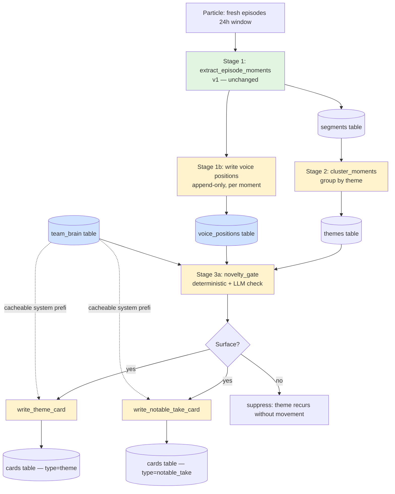

# feat: Podium v2 — editorial reframe (theme cards + voice memory + team brain)

## Summary

Podium v2 shifts the product from coverage to editorial. The v1 pipeline
treats every extracted podcast moment as equal weight and surfaces them
as uniform per-episode cards. The user — a fanatic, not a casual fan —
has identified this as the wrong product: too much noise, no editorial
judgment, too many "I already knew that" cards.

v2 stacks three new layers on top of v1's per-episode moment extraction
(which stays as the raw substrate):

1. **Theme clustering** — group moments across N podcasts in a 24h
   window into themes. Topic header = validation ("8 podcasts on the
   Australia trip"); the value is the takes inside, attributed by
   voice.
2. **Take-level novelty gate** — surface a take only if it represents
   *movement* (new voice, new fact, contrarian turn, position-shift
   for a known voice). Topic novelty is not the criterion; the
   fanatic already knows the topics.
3. **Stateful team brain + per-voice memory** — Podium maintains a
   running model of the team and a running model of each Tier-A
   voice's positions. Voice speaks like a fan because the team brain
   is grounded; novelty detection works because voice memory is
   real.

Two card types replace the single uniform card: **theme cards** (≥ N
podcasts on the same topic, takes attributed inside) and **notable
take cards** (Tier-A voice with a substantive solo take). v1 surfaces
49ers single-team; the schema supports multi-team / multi-user /
multi-sport for v2-and-beyond.

The single most-feared failure mode is take-level repetition. Voice
memory must actually catch "Mina already said this" and suppress.

---

## Problem Frame

**Origin**: docs/brainstorms/podium-v2-editorial-direction.md

The v1 production digest landed in working state on 2026-05-16 (cards
across the week, reliability scaffolding shipped). The maker then ran
the product for a day as a real user and surfaced the editorial gap:

- v1's value framing is *efficiency* ("save 150 min of podcasts in 2
  min"). The right framing is *editorial* ("make sure I didn't miss
  what the smart voices said").
- v1 treats Locked On 49ers and Mina Kimes Show as equal-weight
  sources. The fanatic doesn't — they open Podium *specifically* for
  the named voices, with the local treadmills serving as a frequency
  signal at best.
- v1 produces one uniform card type for every extracted moment. The
  user actually needs two: a "the conversation" card (cross-source
  aggregation showing what podcast world is discussing) and a "the
  notable take" card (a sharp solo opinion from a voice they trust).
- v1 has no novelty awareness. If Mina argued X about Purdy last
  week and argues X again this week, v1 shows both as equally
  surface-worthy. The fanatic mentally bins this as filler and
  loses trust in the product.

The dealbreaker scenario, from the brainstorm's failure-modes
section: the user opens Podium on day 14 of the Purdy contract
discourse, sees a Mina take they already knew Mina held, and the
illusion of curation breaks. **This is the primary failure mode
v2 designs against.**

---

## Scope

### In scope

- New extraction-derived layer: per-moment speaker attribution +
  append-only voice-position writes.
- New post-extraction clustering layer that produces theme
  candidates from a 24h moment window.
- Deterministic-where-possible novelty gate: voice memory
  comparison, manufactured-aggregation detection, theme-recurrence
  suppression.
- Hand-curated 49ers team brain (v1 seed) + weekly auto-update
  job.
- Two new card types (theme cards, notable take cards) with
  dedicated card-writer prompts grounded in team brain.
- Catalog tiering (A/B/C) as a `podcasts.tier` column + config
  source of truth.
- Surfacing layer: new load functions, merged feed with
  discriminated card-type union, new card components.
- Feature flag gating v2 cards so v1 surface stays intact during
  rollout.

### Deferred for later (from origin)

These appear in the brainstorm's "What v1 should validate before v2
scales" and "Out of scope" sections and are explicitly held off this
plan:

- Notifications / push (a real product layer, separate from
  editorial design).
- Reading-list / save-for-later behaviors.
- Social / sharing.
- Audio player redesign (existing player is fine).
- Multi-team UI surface (schema is ready; UI stays 49ers in v1).
- v2 success-metric definitions beyond "does the feed feel
  curated" — measured by maker dogfooding, not analytics.

### Outside this product's identity (from origin)

- Generic NFL news aggregation — Podium is fanatic-and-team-aware,
  not a news ticker.
- Coverage-mode summarization for casual fans — explicitly the
  wrong product per the editorial reframe.

### Deferred to Follow-Up Work

Plan-local items where execution sequencing pushes them out of this
plan:

- Automatic catalog re-tiering (e.g., promoting a Tier-B show to
  Tier-A based on engagement signals). v1 ships with manual
  tiering only.
- Theme-card "delta copy generation" tooling for daily-update
  arcs ("Day 14 of the Purdy debate — Mina just flipped"). v1
  surfaces novel takes; sophisticated delta narration is v2.5.

---

## Origin context

The full editorial direction lives in
docs/brainstorms/podium-v2-editorial-direction.md. Key
constraints carried forward verbatim:

- **Target reader**: fanatic, not casual (see origin §Target
  reader).
- **Rhythm**: morning daily read, 24h window (see origin
  §Rhythm).
- **Two card types**: theme + notable take (see origin §Two card
  types).
- **Novelty at the take level, not topic level** (see origin
  §Novelty gate). *Primary dealbreaker = take-level repetition.*
- **Voice = fan-of-this-team, grounded in team brain, not loud**
  (see origin §Voice).
- **Tier A is the spine**; Tier C is mostly frequency-signal (see
  origin §Catalog tiering).
- **Architecture must hold under multi-team** even though v1
  surfaces single team.

---

## High-Level Technical Design

*This illustrates the intended approach and is directional guidance
for review, not implementation specification. The implementing agent
should treat it as context, not code to reproduce.*

The v2 daily run extends the existing single-stage pipeline into a
three-stage flow. Each stage produces a persisted artifact so a
crash mid-flow doesn't lose prior work (matches v1's existing
silent-failure detection posture).



Legend: green = v1, unchanged. Yellow = v2, new. Blue = v2,
stateful catalog tables.

**Why staged:**
- Stage 1 (existing) extracts moments. This is the load-bearing
  raw material and stays unchanged.
- Stage 1b writes voice positions append-only as moments are
  persisted. No new fetch cost; voice memory grows from data
  already paid-for.
- Stage 2 clusters the 24h moment window by topic. One Anthropic
  call per run, cacheable system prefix.
- Stage 3 applies the novelty gate per cluster, then writes
  card copy for surfacing themes/takes. Both card-writer calls
  inline the team brain as the cacheable system prefix, hitting
  Haiku 4.5's 4,096-token cache floor.

**Why this fits the 240s pipeline deadline:** Stage 1 is unchanged.
Stage 1b is a Supabase write per moment (cheap). Stage 2 is one
Claude call. Stage 3 is N card-writer calls (one per surfaced
theme + one per surfaced solo take, with N typically 2-5).
Worst-case wall time: 1 (cluster) + 5 (cards) Claude calls at
~30s each = ~180s, well inside the 240s guard.

**Architectural lever — team brain as cacheable system prefix.**
The team brain is intentionally serialized to ≥4,096 tokens so it
clears Haiku 4.5's cache minimum (see
docs/solutions/2026-05-13-anthropic-haiku-4-5-cache-minimum.md).
This makes the team brain do double duty: grounding the voice on
every card-writer call AND amortizing prompt cost across runs.

---

## Output Structure

New directories and files this plan creates (existing files
modified are not shown here; see per-unit `**Files:**` sections):

```
lib/
  themes/
    cluster-moments.ts          # Stage 2: group moments by theme
    novelty-gate.ts             # Stage 3a: deterministic + LLM check
    detect-manufactured.ts      # match.source + phrase-overlap heuristic
    types.ts                    # ThemeCandidate, NoveltySignal shapes
  voice-memory/
    write.ts                    # append-only write at extraction time
    load.ts                     # read prior positions for a voice
    detect-shift.ts             # compare new take to prior positions
    types.ts                    # VoicePosition, ShiftKind shapes
  team-brain/
    load.ts                     # read current brain
    update.ts                   # weekly summarization update
    serialize-for-prompt.ts     # render brain as cacheable system prefix
    types.ts                    # TeamBrain shape
  anthropic/prompts/
    theme-card.ts               # write_theme_card system prompt
    notable-take-card.ts        # write_notable_take_card system prompt
    theme-clustering.ts         # cluster_moments system prompt
    team-brain-update.ts        # weekly update system prompt
  digest/
    load-themes.ts              # query themes for surfacing
    load-notable-takes.ts       # query Tier-A solo takes
    merge-feed.ts               # unified discriminated union, ordered

components/digest/
  theme-card.tsx                # theme card surface
  notable-take-card.tsx         # solo Tier-A take surface
  card-renderer.tsx             # dispatch by card type

app/api/cron/
  weekly-brain-update/route.ts  # weekly team brain refresh

config/
  tiers.ts                      # Tier A/B/C assignment per slug

supabase/migrations/
  0017_podcasts_tier.sql
  0018_team_brain.sql
  0019_voices_and_positions.sql
  0020_themes_table.sql
  0021_cards_card_type.sql

scripts/
  seed-team-brain.ts            # hand-curate initial 49ers brain
  probe-speaker-attribution.ts  # diagnostic before voice memory lands
```

The tree is a scope declaration showing the expected output shape.
The implementer may adjust if implementation reveals a better layout.
Per-unit `**Files:**` sections remain authoritative.

---

## Key Technical Decisions

### KD1. Team brain is a cacheable system prefix, not a tool-supplied parameter

The team brain is serialized to a stable text block and inlined as
the system prompt prefix on every v2 card-writer Claude call. This
clears Haiku 4.5's 4,096-token cache floor (see
docs/solutions/2026-05-13-anthropic-haiku-4-5-cache-minimum.md)
and grounds the voice in one move.

**Rationale:** Without ≥4,096 tokens of cacheable prefix, Haiku 4.5
silently returns 0/0 in cache token counts — no caching, no
warning. We need both grounding AND caching; intentional inlining
gets both.

**Alternative rejected:** Pass team brain as a tool parameter
on each call. Would not contribute to cacheable prefix, costing
~3× per-call tokens. Rejected.

### KD2. Voice memory writes are append-only at extraction time

Voice positions are written as `extract_episode_moments` persists
each moment, never reconstituted by re-fetching transcripts.

**Rationale:** Particle Starter tier hard-blocks at 402 with no
graceful degrade (see
docs/solutions/2026-05-09-particle-cost-estimate.md). Any code
path that "rebuilds voice memory from the last 30 days" exceeds
the credit budget. Write-on-extract makes voice memory
incremental and bounded by ingest cost we already pay.

**Implication:** Voice memory will be sparse at v2 launch and
build up over weeks. The novelty gate's effectiveness improves
over time. This is acceptable for v1 dogfooding; if it bites,
we backfill by re-extracting the last 30 days once (one-time
cost spike, manually approved).

### KD3. Speaker attribution is verified before voice memory commits

A pre-flight diagnostic script measures `segments.speaker_name`
fill rate on Tier-A shows before U3 voice memory infrastructure
lands. Two branches:

- **≥90% coverage on Tier-A**: voice memory keys on
  `speaker.name` (allows host vs guest discrimination).
- **<90% coverage**: fall back to **show-level voice** — treat
  the whole Mina Kimes Show as one voice, irrespective of
  individual speaker. Lower fidelity but doesn't fabricate
  attribution.

**Rationale:** Voice memory is foundational to the novelty
gate. Building it on unreliable signal is the fastest way to
produce the dealbreaker (take-level repetition mis-detection).
Diagnose first, then commit.

### KD4. Novelty gate is deterministic where structural, LLM where semantic

Four novelty signals, each implemented to maximize determinism:

- **new_voice**: deterministic — voice has no prior position on
  this topic in `voice_positions`. SQL check.
- **new_fact**: LLM check, but constrained to "is this fact
  present in any prior segment for this team in the last N
  days." Tool-use call with structured output.
- **contrarian_turn**: hybrid — embedding distance or LLM
  semantic comparison against the day's other takes. Surfaces
  when this take is structurally far from the day's consensus.
- **position_shift**: hybrid — voice has prior positions on
  topic, but today's stated position contradicts. LLM
  classifies "shift" vs "restate" with explicit per-axis
  rationale.

**Rationale:** Prior extractor work (see
docs/solutions/2026-05-12-episode-extraction-prompt.md) showed
stochasticity on borderline cases. The novelty gate is the
critical-path quality check — Monday-vs-Tuesday flip-flopping
on the same take is exactly the dealbreaker. Deterministic
where possible; structured-output LLM where not; never
free-form vibes judgment.

### KD5. Manufactured-aggregation filter uses signal already in the data

Before a cluster is treated as "8 podcasts independently engaging
on X," we check three signals that already live on `segments`:

- All cluster members share `match.source = "keyword"` on the
  same entity → likely news-cycle echo.
- All cluster members have `published_at` within a 4-hour window
  → likely reacting to a single upstream article.
- Cluster members share a verbatim phrase of ≥6 tokens →
  likely quoting the same source.

When 2+ signals fire, the cluster gets a `news_echo` tag and is
treated as Tier-N (news, not analysis). Doesn't suppress —
fanatics still want to see "8 podcasts reacted to the schedule
release" — but the card copy reflects "reacting to news" rather
than "independently arrived at a take."

**Rationale:** Brainstorm failure mode #4 (manufactured
aggregation). The signal exists in `segments` already; we just
need to use it. No new fetch cost.

### KD6. v2 cards ship behind a feature flag, v1 cards keep working

A `NEXT_PUBLIC_PODIUM_V2_FEED` env flag toggles the home-page
feed between v1 (episode cards) and v2 (themes + notable
takes). Both code paths coexist until v2 is dogfooded clean.

**Rationale:** The maker is the primary user; switching cold
makes regressions painful. Flag lets v2 be tested in production
data with one-line rollback. Once v2 is trusted, v1 episode
cards can be demoted to a "raw moments" archive view (or
removed).

### KD7. Theme storage is user-scoped; voice memory and team brain are catalog

Theme rows are user-scoped (`themes` table with `user_id`,
`team_id`) and follow the same RLS shape as `cards` (owner
reads own, service-role writes). Voice positions and team
brain are catalog (read-by-authenticated, service-role
writes).

**Rationale:** Themes surface to a specific user's feed; they
should obey the same RLS posture as `cards`. Voice memory and
team brain are shared infrastructure across all users following
that team or voice; they belong on the catalog side. This
matches the v1 migration pattern (see migration 0010 which
made operational tables service-role-only).

### KD8. Each new persisted-output table carries a `prompt_version` column

Every v2 table that holds LLM-generated content (`themes`, the
`cards.episode_summary` analog for theme cards, voice positions
when generated by LLM not pure extraction) carries a
`prompt_version` column matching `EPISODE_EXTRACTION_PROMPT_VERSION`
constant pattern from `lib/anthropic/types.ts`.

**Rationale:** v1 established that bumping a prompt version
triggers auto-reprocessing without manual cleanup (migration
0014). v2 will iterate on prompts heavily during dogfooding;
the same auto-reprocess pattern saves manual DB surgery.

---

## Implementation Units

Sequenced in five phases. Each phase validates an editorial
hypothesis before the next phase commits to building on it.

### Phase 1 — Foundation & Static Tiers
*Validates: does coarse tiering alone improve signal-to-noise?*

### U1. Catalog tiering — `podcasts.tier` column + config source

**Goal:** Add tier metadata to the catalog so downstream logic
can weight Tier A as the spine and Tier C as frequency-signal
only.

**Requirements:** Origin §Catalog tiering. Foundational
dependency for all subsequent units that distinguish voices.

**Dependencies:** none

**Files:**
- `supabase/migrations/0017_podcasts_tier.sql` (new) — adds
  `tier text not null default 'C' check (tier in ('A','B','C'))`
  to `podcasts`.
- `config/tiers.ts` (new) — exports a `Record<particleSlug, Tier>`
  with Tier A/B/C assignments for all 36 catalog podcasts. Tier
  A: Mina Kimes Show, Bill Simmons Podcast, Pat McAfee Show, The
  Athletic Football Show, Football 301, The Ringer NFL Show.
  Tier B: PFT Live, Rich Eisen, MMQB, Get Up, Heed the Call,
  Move the Sticks, Pardon My Take, Pablo Torre, Domonique
  Foxworth, Right Time. Tier C: everything else (locked-on,
  gold standard, 49ers talk, krueg, section 415, KNBR, leeds
  view, fantasy, jim rome, first take, first things first,
  nightcap, arena, herd, dan patrick, mcshay, ross tucker,
  athletic, herd, etc.).
- `scripts/seed-supabase.ts` — extend to write `tier` from
  `config/tiers.ts` on each podcast row.
- `__tests__/lib/config/tiers.test.ts` (new) — every entry in
  `config/podcasts.ts` has a corresponding tier; no orphan
  tiers.

**Approach:** Add the column with a safe default ('C'), then
backfill from `config/tiers.ts` via seed script. The migration
is additive and back-compatible with v1's existing
read path.

**Patterns to follow:** Existing `config/podcasts.ts` shape;
migration filename convention `NNNN_snake_case.sql`; seed
script's `on conflict (particle_slug) do update set tier = ...`
upsert pattern.

**Test scenarios:**
- Tier assignments map 1:1 to current `config/podcasts.ts`
  entries (no missing slugs).
- Tier values are exactly one of 'A', 'B', 'C' (enum check).
- Seed run is idempotent — re-running does not flip tier values.
- Tier A list explicitly contains Mina Kimes, Bill Simmons, Pat
  McAfee, Athletic Football Show, Football 301.

**Verification:** After seed, `select tier, count(*) from
podcasts group by tier` returns 3 rows summing to 36, with the
distribution roughly 6/10/20.

### U2. Hand-curated 49ers team brain seed

**Goal:** Stand up the `team_brain` table and seed it with a
hand-curated 49ers brain rich enough (≥4,096 tokens when
serialized) to clear Haiku 4.5's cache floor and ground the
voice on every v2 Claude call.

**Requirements:** Origin §Stateful team brain. Cacheable-prefix
strategy (KD1). Foundational for Phase 3.

**Dependencies:** none

**Files:**
- `supabase/migrations/0018_team_brain.sql` (new) — table
  `team_brain (team_id text primary key references teams(id),
  payload jsonb not null, prompt_version text not null,
  updated_at timestamptz not null default now())`. RLS:
  `read by authenticated`, service-role insert/update.
- `lib/team-brain/types.ts` (new) — `TeamBrain` shape:
  `{ team_id, roster, season_storyline, narrative_arcs,
  fan_psychology, recent_themes, updated_at }`. Each subfield
  typed; `recent_themes` is structured as `{ theme_id,
  summary, first_seen, last_seen, hot }`.
- `lib/team-brain/load.ts` (new) — read current brain for a
  team. Returns null if absent.
- `lib/team-brain/serialize-for-prompt.ts` (new) — render
  brain as a stable text block targeting ~5,000 tokens.
  Deterministic ordering of fields so the cache prefix is
  byte-stable across runs.
- `scripts/seed-team-brain.ts` (new) — hand-curated initial
  49ers payload, inserted into DB.
- `__tests__/lib/team-brain/serialize-for-prompt.test.ts`
  (new) — output is byte-stable across two calls with the
  same input; output length is ≥4,096 tokens for the seeded
  49ers payload.

**Approach:** Migration creates the table. Seed script writes
a manually-crafted 49ers payload covering: roster age profile
+ key positions, 2026 season storyline-to-date, active
narrative arcs (Purdy contract, WR room, Shanahan playoff
history, schedule difficulty), fan psychology (what 49ers fans
obsess about, what triggers them), recent themes (left blank
at seed, populated by U10 weekly update).

The serializer renders the JSON payload as a stable text
block — fields in a fixed order, no timestamps in the
serialized output (timestamps live in the row metadata, not
the prompt prefix, so the prefix stays cache-stable).

**Patterns to follow:** Existing seed script in
`scripts/seed-supabase.ts` (env-loaded service-role client,
on-conflict upsert). Existing catalog-table RLS pattern in
migration `0002_rls_policies.sql`.

**Test scenarios:**
- Serializer output for the 49ers seed payload is ≥4,096
  tokens (measured by tokenizing with the Anthropic
  tokenizer, not naive whitespace split).
- Serializer is deterministic: same input → same output
  byte-for-byte across 10 calls.
- Seed script is idempotent: re-running does not duplicate
  rows or change `updated_at`.

**Verification:** After seed,
`scripts/debug-cache.ts --prompt-from team-brain` confirms a
cacheable prefix fires on Haiku 4.5 (cache_creation_input_tokens
> 0 on first call, cache_read_input_tokens > 0 on second).

---

### Phase 2 — Voice & Theme Plumbing
*Validates: aggregation clusters reasonably and voice memory
populates correctly from real ingest.*

### U3. Voices catalog + voice positions schema, gated on speaker-attribution probe

**Goal:** Stand up the catalog tables for voice memory after
verifying that Particle's speaker attribution is reliable
enough on Tier-A shows to support per-host voice memory. If
not, scope voice memory to show-level instead.

**Requirements:** Origin §Per-voice memory. KD3 (speaker
attribution diagnostic). Foundational for the novelty gate.

**Dependencies:** U1

**Files:**
- `scripts/probe-speaker-attribution.ts` (new) — for each
  Tier-A podcast, pull the last 30 days of segments and
  report what % have `speaker.name` populated. Output a
  decision: "use speaker.name" or "use show-level voice."
- `supabase/migrations/0019_voices_and_positions.sql` (new):
  - `voices (id text primary key, kind text check in
    ('host', 'show'), display_name text not null, tier text
    not null check in ('A','B','C'), podcast_id uuid
    references podcasts(id), created_at timestamptz default
    now())` — `kind = 'host'` for per-speaker voices; `kind
    = 'show'` for fallback show-level voices.
  - `voice_positions (id uuid primary key default
    gen_random_uuid(), voice_id text references voices(id),
    team_id text references teams(id), topic_key text not
    null, position_summary text not null, evidence_quote
    text, segment_id uuid references segments(id),
    prompt_version text not null, created_at timestamptz
    default now())` — append-only.
- `config/voices.ts` (new) — seed list. Either per-host
  (Mina Kimes, Bill Simmons, Pat McAfee, …) or per-show
  fallback, depending on probe outcome.
- `lib/voice-memory/types.ts` (new) — `VoiceId`,
  `VoicePosition`, `ShiftKind` (`new_voice` | `restate` |
  `position_shift`).
- `lib/voice-memory/load.ts` (new) — read all positions for
  a `voice_id × team_id × topic_key` tuple, newest first.
- `__tests__/scripts/probe-speaker-attribution.test.ts`
  (new) — probe script returns a structured decision; given
  mock data with 95% coverage returns "host"; with 50%
  returns "show".

**Approach:** The probe script runs first. Its output (a JSON
blob with per-show coverage and a recommended `kind`) drives
the seed shape in `config/voices.ts`. The migration is run
regardless — the table shape supports both modes.

**Execution note:** Run the probe script against production
data before applying the migration. Decide `kind` based on
the result, then seed accordingly. This is a planning-time
question deferred to implementation because the answer
depends on Particle data we haven't measured yet.

**Patterns to follow:** Existing `scripts/inspect-list-calls.ts`
for the probe-style script shape; existing catalog migration
conventions.

**Test scenarios:**
- Probe script handles mixed coverage (e.g., 95% on Mina, 30%
  on Pat McAfee Show) and produces a per-show recommendation
  rather than one global verdict.
- `voice_positions` UNIQUE constraint on `(voice_id, team_id,
  topic_key, segment_id)` prevents double-write from a
  single moment.
- Load function returns positions in `created_at desc` order.
- Append-only: no UPDATE or DELETE permitted by RLS policy.

**Verification:** Probe script outputs per-Tier-A coverage
report. Migration applies cleanly. `select count(*) from
voices` matches seeded count.

### U4. Stage 1b — write voice positions during extraction

**Goal:** Extend the existing extraction pipeline to write
voice positions to `voice_positions` as each moment lands,
attributing the moment to a voice (host-level if speaker.name
is reliable, otherwise show-level).

**Requirements:** Origin §Per-voice memory. KD2 (append-only,
no re-fetch). Voice memory must accumulate for U6 novelty gate
to function.

**Dependencies:** U3

**Files:**
- `lib/voice-memory/write.ts` (new) — given a persisted
  moment + its speaker attribution + the topic_key, write a
  `voice_positions` row.
- `lib/voice-memory/extract-topic-key.ts` (new) — derive a
  stable topic_key from a moment. Initially a slug derived
  from the dominant `surfacing_entities` + a coarse topic
  fingerprint (e.g., `purdy-contract`, `wr-room`,
  `shanahan-rebuild`). Tunable.
- `lib/ingest/pipeline.ts` — modify the segment-persistence
  loop (around lines 322–427 per repo research) to call
  `voice-memory/write.ts` immediately after segment upsert.
  Single line addition inside the moment loop; tracked-call
  wrapped if any Anthropic call is needed (topic_key
  derivation may be deterministic only — see approach).
- `lib/ingest/types.ts` — extend `IngestPipelineOutput` with
  `voicePositionsWritten: number`.
- `__tests__/lib/voice-memory/write.test.ts` (new)
- `__tests__/lib/ingest/pipeline.test.ts` — extend to assert
  voice_positions written per moment.

**Approach:** Voice positions are derivative of moments, so
they write inline as part of persistence. Topic_key
derivation in v1 is deterministic — slugify the top
`surfacing_entity`. No Anthropic call needed at write time;
sophistication can come later (KD4 governs the novelty-gate
side, not the write side).

If the speaker-attribution probe recommends host-level voice
but a given segment has no `speaker.name`, fall back to
show-level voice for that segment so writes never fail
silently.

**Patterns to follow:** Existing segment-upsert pattern in
`lib/ingest/pipeline.ts`; UNIQUE constraint idempotency
(matches `segments.particle_segment_id` pattern).

**Test scenarios:**
- Single moment with `speaker.name = "Mina Kimes"` writes
  one row keyed on the Mina voice_id.
- Same moment processed twice does not duplicate the row
  (UNIQUE constraint).
- Moment with null `speaker.name` falls back to show-level
  voice without throwing.
- Topic_key derivation is deterministic across two calls
  with the same input.
- `voicePositionsWritten` counter accurate per run.

**Verification:** After a clean run on production, `select
count(*) from voice_positions where created_at >
now() - interval '1 day'` matches `segmentsPersisted` count
from the run's `system_alerts._complete` row.

### U5. Stage 2 — cluster moments into theme candidates

**Goal:** After Stage 1 completes, take all moments persisted
in the 24h window and cluster them into theme candidates via a
single Anthropic call. Output a list of themes with member
moment IDs.

**Requirements:** Origin §Theme cards. Cross-source frequency
is the importance signal.

**Dependencies:** U1 (uses tier), U4 (writes precede
clustering)

**Files:**
- `lib/themes/types.ts` (new) — `ThemeCandidate` shape:
  `{ theme_signature, label, member_segment_ids,
  member_voice_ids, surfacing_entities, news_echo }`.
- `lib/anthropic/prompts/theme-clustering.ts` (new) — system
  prompt for the clustering call. Mid-sized prompt; does NOT
  include team brain (theme clustering is topic-grouping, not
  voice-grounded interpretation).
- `lib/anthropic/cluster-themes.ts` (new) — tool-use call,
  zod-validated, retry on schema failure. Mirrors
  `extract-episode-moments.ts` structure.
- `lib/themes/cluster-moments.ts` (new) — orchestrator: load
  24h moments, call `cluster-themes`, post-process to add
  theme_signature (content hash), apply
  manufactured-aggregation tagging from U6's helper.
- `supabase/migrations/0020_themes_table.sql` (new) —
  user-scoped themes table:
  `themes (id uuid primary key, user_id uuid, team_id text,
  theme_signature text, label text, member_segment_ids
  uuid[], member_voice_ids text[], news_echo boolean default
  false, prompt_version text, surfaced_at timestamptz)`.
  RLS: owner-only read; service-role write. UNIQUE on
  `(user_id, team_id, theme_signature, surfaced_at::date)`
  to support same-theme-different-day pattern.
- `lib/anthropic/types.ts` — add
  `THEME_CLUSTERING_PROMPT_VERSION` constant.
- `__tests__/lib/themes/cluster-moments.test.ts` (new)

**Approach:** Run after Stage 1 within the same pipeline
invocation. Single Anthropic call with all 24h moment
summaries as input. Output is a structured list of clusters
with member IDs.

Theme_signature is a deterministic hash of the cluster's
sorted member IDs + dominant surfacing entity — gives a
stable key for cross-day theme detection in U6.

Manufactured-aggregation tag (KD5) is computed at clustering
time, not at novelty time, so it's available as input to the
novelty gate.

**Patterns to follow:** `extract-episode-moments.ts` for
tool-use call structure, zod validation, retry-on-failure.
Cost-tracked via `createAnthropicClient.createMessage()`
with operation = `"cluster_themes"`.

**Test scenarios:**
- Given 10 moments across 5 podcasts where 4 discuss "schedule
  release" and 6 discuss "Purdy contract", returns 2 themes
  with correct member groupings.
- A theme that recurs the next day produces an identical
  `theme_signature` (so U6 can dedupe).
- Anthropic call returning malformed JSON triggers one retry,
  then writes a `segmentsFailedSummary`-equivalent stat.
- News-echo signal computed correctly: when all 4 members of
  a cluster have `match.source = "keyword"` on the same
  entity AND `published_at` within 4h, `news_echo = true`.
- Tracked-call wrapper logs to `api_calls` with the right
  operation name and team_id.

**Verification:** On a real production run, the themes table
has a coherent set of clusters where most members share
topical content. Reviewed manually by the maker against the
day's actual moments — does the clustering match the user's
sense of "yes those are the same conversations"?

---

### Phase 3 — Novelty & Card Writing
*Validates: novelty gate produces a smaller, sharper feed
than v1's uniform extraction.*

### U6. Novelty gate

**Goal:** For each theme candidate (and each Tier-A solo
moment), decide whether to surface based on the four novelty
signals (KD4).

**Requirements:** Origin §Novelty gate (take-level, not
topic-level). KD4 (deterministic where possible). Primary
dealbreaker design target.

**Dependencies:** U2 (team brain for context), U3+U4 (voice
memory must be populating), U5 (theme candidates)

**Files:**
- `lib/themes/novelty-gate.ts` (new) — main entry. Takes a
  theme candidate or a solo Tier-A moment, returns
  `{ surface: bool, signals: NoveltySignal[], rationale:
  string }`.
- `lib/themes/detect-manufactured.ts` (new) — implements the
  three heuristics from KD5 (shared match.source, published_at
  proximity, verbatim phrase overlap).
- `lib/voice-memory/detect-shift.ts` (new) — given a new
  moment + the relevant voice's prior positions, classify as
  `new_voice | restate | position_shift`. Hybrid: structured
  prior-position load is deterministic; the
  restate-vs-shift call uses a small Anthropic call with
  tool-use output.
- `lib/anthropic/prompts/detect-shift.ts` (new) — the
  shift-detection prompt. Inline team brain (cacheable
  prefix).
- `__tests__/lib/themes/novelty-gate.test.ts` (new)
- `__tests__/lib/voice-memory/detect-shift.test.ts` (new)

**Approach:** Novelty gate runs per theme + per Tier-A solo
moment. Pipeline:

1. **new_voice check** (deterministic SQL): does this
   voice_id have any prior position on this topic_key?
2. **manufactured-aggregation check** (deterministic):
   apply U5's news_echo tag. If true, theme is treated as
   news-cycle echo; the card copy in U7 reflects this but
   the theme still surfaces.
3. **theme-recurrence check** (deterministic): does this
   `theme_signature` appear in `themes` from yesterday or
   the day before? If yes, surface only if at least one
   `new_voice` or `position_shift` signal fires.
4. **position_shift check** (LLM): for each cluster member
   whose voice has prior positions, call
   `detect-shift.ts`. If any return `position_shift`,
   surface the theme with a "shift" annotation.

For solo Tier-A moments: same checks apply, scoped to a
single voice/segment. Surface if any of {new_voice,
position_shift, new_fact} fires.

Returns structured rationale so card-writer prompts can use
the "what's new" delta as copy hook.

**Patterns to follow:** Tool-use call with structured output
matching `extract-episode-moments.ts`; deterministic-first
posture.

**Test scenarios:**
- New voice on a topic: `new_voice = true`, surfaces.
- Same voice restating a known position (per `voice_positions`
  history): `restate = true`, suppresses if theme also
  recurs.
- Same voice with a contradictory position: `position_shift =
  true`, surfaces with annotation.
- News echo (4 members, shared keyword + 4h window): theme
  surfaces with `news_echo` tag.
- Theme with `theme_signature` matching yesterday's but no
  novelty signals: suppressed.
- Theme with `theme_signature` matching yesterday's AND a
  new voice: surfaces with delta annotation.
- LLM call returns malformed shift classification: retry
  once, then default to `restate` (conservative — avoid
  false positives on the primary dealbreaker).

**Verification:** Manual dogfooding by the maker for at least
3 consecutive days. The maker should NOT see a take they
already knew that voice held. Repetition = bug, file an
issue against this unit.

### U7. Theme card writer + notable take card writer

**Goal:** Two card-writer Anthropic calls that produce the
final card copy, both grounded in team brain (cacheable
system prefix) and validated against verbatim transcript
quotes.

**Requirements:** Origin §Voice (fan-of-this-team, grounded
in team brain). KD1 (team brain as cacheable prefix).
Failure mode #5 from origin (sharp quote, tepid excerpt).

**Dependencies:** U2 (team brain seed), U6 (novelty rationale
as input)

**Files:**
- `lib/anthropic/prompts/theme-card.ts` (new) — system
  prompt for theme card. Inlines team brain
  (`serializeForPrompt`). Expects input: theme + member
  moment summaries + voice attributions + novelty rationale.
  Output: card title, lede, per-voice "what they said" lines
  with verbatim quote, "what's new today" delta line if
  applicable.
- `lib/anthropic/prompts/notable-take-card.ts` (new) —
  system prompt for solo Tier-A. Input: moment + voice +
  novelty rationale. Output: card title, the sharp quote,
  voice attribution, why it matters (team-brain grounded).
- `lib/anthropic/write-theme-card.ts` (new) — tool-use call,
  zod-validated. Verbatim-quote validation + retry pattern
  (per docs/solutions/2026-05-12-episode-extraction-prompt.md).
- `lib/anthropic/write-notable-take-card.ts` (new) — same
  shape.
- `supabase/migrations/0021_cards_card_type.sql` (new) —
  extend `cards` with `card_type text default 'episode'
  check (card_type in ('episode', 'theme', 'notable_take'))`,
  `theme_id uuid references themes(id) null`,
  `notable_take_voice_id text references voices(id) null`,
  `prompt_version text null`, `card_title text null`,
  `card_body jsonb null` (structured body for typed cards;
  episode cards continue to use the legacy `episode_summary`
  text field for back-compat).
- `lib/anthropic/types.ts` — add
  `THEME_CARD_PROMPT_VERSION` and
  `NOTABLE_TAKE_CARD_PROMPT_VERSION` constants.
- `__tests__/lib/anthropic/write-theme-card.test.ts` (new)
- `__tests__/lib/anthropic/write-notable-take-card.test.ts`
  (new)

**Approach:** Both prompts use the same cacheable-prefix
shape: `[team_brain_text] + [tool definitions] +
[per-card input]`. Team brain is the largest stable block;
tool definitions are stable; per-card input varies. Cache
read should hit after the first call.

Verbatim-quote validation: card output includes pull-quote
spans. Each quote must be a substring of the source segment's
`raw_transcript` (post-ad-strip). Failed validation → retry
with a `tool_result` block explaining which quote failed.
Per the brainstorm dealbreaker #5, the quote IS the value;
do not let the model paraphrase to recover.

**Execution note:** Start with a failing integration test for
each card-writer that exercises the verbatim-quote validation
path. The dealbreaker is "tepid summary instead of sharp
quote" — the test is the spec.

**Patterns to follow:**
`lib/anthropic/extract-episode-moments.ts` for tool-use shape,
zod validation, retry-on-failure, quote validation, cache
control on system + tools. Cost-tracked via
`createAnthropicClient.createMessage()` with operations
`"write_theme_card"` and `"write_notable_take_card"`.

**Test scenarios:**
- Theme card output contains at least one verbatim quote
  per voice; non-verbatim quote triggers retry.
- After max retries with persistent quote failure, card is
  emitted with the failing quote dropped (matches
  `extract-episode-moments.ts` graceful degradation).
- `cache_creation_input_tokens > 0` on first call;
  `cache_read_input_tokens > 0` on second call with same
  team_brain.
- Notable take card output references the team brain
  (e.g., card body mentions a roster constraint or
  season storyline that's in the brain payload).
- Output token cap is sufficient — test with worst-case
  input (theme with 6 voices each contributing a quote).
- Tracked-call wrapper logs to `api_calls` with the right
  operation name and team_id.
- Both writers handle null `surfacing_entities` without
  throwing.

**Verification:** Manual review of generated card copy
against the dealbreaker tests: (a) is the quote sharp,
(b) does the card sound like a fan who knows the team,
(c) does the card avoid generic sports-blog cadence.

---

### Phase 4 — Surface (UI + Load)
*Validates: the new card mix lands cleanly in the existing
day-grid and feels right when dogfooded.*

### U8. Load functions + merged feed with discriminated card-type union

**Goal:** Read the three card types (episode, theme,
notable_take) from `cards`, merge into a unified ordered
feed, expose a discriminated-union shape to the UI.

**Requirements:** Origin §Two card types. v1 episode cards
must remain accessible behind the feature flag (KD6).

**Dependencies:** U7 (writes the new card rows)

**Files:**
- `lib/digest/load-themes.ts` (new) — pulls theme cards
  (`cards` rows where `card_type = 'theme'`) joined with
  `themes` for member info, with member voices joined for
  attribution.
- `lib/digest/load-notable-takes.ts` (new) — pulls
  `card_type = 'notable_take'` rows with voice + segment
  join.
- `lib/digest/merge-feed.ts` (new) — calls both loads + the
  existing `load-cards.ts` (episode cards), returns a
  discriminated union sorted by `surfaced_at desc`.
  Discriminator: `card_type`.
- `lib/digest/types.ts` (new or extend existing
  `load-cards.ts`) — `DigestFeedItem =
  | (DigestCard & { card_type: 'episode' })
  | (DigestThemeCard & { card_type: 'theme' })
  | (DigestNotableTakeCard & { card_type:
  'notable_take' })`.
- `__tests__/lib/digest/merge-feed.test.ts` (new)

**Approach:** Three parallel reads via
`Promise.allSettled` (matches existing
`app/(app)/page.tsx` posture). Merge by `surfaced_at`. The
feature flag (KD6) determines whether `merge-feed` returns
just episode cards (v1) or the full union (v2).

Feedback (hidden cards / hidden segments) still applies —
the existing `hiddenCardIds`/`hiddenSegmentIds` anti-join
pattern in `load-cards.ts` extends to theme and
notable-take cards.

**Patterns to follow:** Existing `load-cards.ts` for the
embedded-select pattern; existing
`groupCardsByDayWindow` pattern (the merge produces a flat
feed; the home page groups it).

**Test scenarios:**
- Feature flag off: returns only episode cards (v1 behavior
  preserved).
- Feature flag on: returns all three types interleaved by
  `surfaced_at`.
- Feedback hidden card_id is filtered out regardless of
  card_type.
- Empty result handles cleanly (returns empty array, no
  throw).
- Discriminator narrows correctly in TypeScript (compile-time
  test).

**Verification:** Unit tests pass. Smoke test on a real
day's data: the merged feed contains a mix of card types in
expected proportion (theme cards from clustered moments,
notable takes from solo Tier-A moments, plus episode cards
behind the flag).

### U9. New card components + page dispatch by card type

**Goal:** Render theme cards and notable take cards in the
home-page grid alongside (or replacing) episode cards.

**Requirements:** Origin §Two card types. Existing visual
language preserved (taps open Sheet, feedback bar, audio
player).

**Dependencies:** U8

**Files:**
- `components/digest/card-renderer.tsx` (new) — discriminated
  dispatcher: takes a `DigestFeedItem`, renders the right
  card component.
- `components/digest/theme-card.tsx` (new) — theme card
  surface. Header = topic + "N podcasts" badge. Body =
  per-voice "what they said" lines with attribution and
  quote. Tap → Sheet showing all member moments with audio.
- `components/digest/notable-take-card.tsx` (new) — solo
  Tier-A take. Voice attribution prominent (avatar/icon if
  available, name always). Sharp quote front-and-center.
  "Why it matters" line grounded in team brain. Tap →
  Sheet with full moment audio.
- `app/(app)/page.tsx` — replace `<EpisodeCard card={c} />`
  in the grid with `<CardRenderer item={c} />`. The
  surrounding day-grid logic stays unchanged.
- `lib/env.ts` — add
  `NEXT_PUBLIC_PODIUM_V2_FEED: z.enum(['on', 'off']).default('off')`
  to the client-readable block.
- `__tests__/components/digest/card-renderer.test.tsx` (new)
- `__tests__/components/digest/theme-card.test.tsx` (new)
- `__tests__/components/digest/notable-take-card.test.tsx`
  (new)

**Approach:** Card-renderer is a tiny switch on `card_type`.
Theme card and notable take card components mirror
`episode-card.tsx`'s structure (article wrapper, Sheet
trigger, FeedbackBar) but with their own header/body
layouts.

Theme card visual: topic-as-headline + a small chip "8
podcasts." Inside, a short list of voice-attributed pull
quotes. Tap to expand into Sheet showing per-voice audio
clips.

Notable take card visual: voice avatar + name as the
primary identity, the sharp quote as the body, "why it
matters" as a smaller line below. Less dense than theme
card.

Feature flag respected at the page level (read once in the
RSC; passed to `merge-feed`).

**Patterns to follow:** `episode-card.tsx` for the
`Sheet`/`AudioPlayer`/`FeedbackBar` composition; existing
shadcn primitive use; design tokens via Tailwind v4
`@theme inline`.

**Test scenarios:**
- Card-renderer dispatches the right component for each
  card_type.
- Unknown card_type renders a fallback (defensive — should
  never happen in practice, but typed exhaustiveness).
- Theme card with 0 quotes (edge case) renders cleanly
  without empty list.
- Notable take card with null `why_it_matters` renders just
  quote + attribution.
- Feedback bar action works on theme + notable take cards
  (hidden_at populates correctly per card_type).
- Sheet open/close interactions match episode card's
  Motion-driven AnimatePresence.

**Verification:** Manual UI review with feature flag on.
Open localhost, scroll through a day's feed. Does it look
like a publication or like a tool? (Per origin §Voice, the
answer should be publication.)

---

### Phase 5 — Maintenance
*Validates: team brain stays current week-over-week.*

### U10. Weekly team brain update cron

**Goal:** A separate weekly cron that summarizes the past
week's themes + active narrative arcs and updates the
`team_brain` row.

**Requirements:** Origin §Stateful team brain (continuously
maintained). KD2 reasoning (append-only at extraction time
covers voice memory but team brain needs explicit
maintenance).

**Dependencies:** U2 (table + seed), U5 (themes table to
summarize), U7 (cards table to mine for what surfaced)

**Files:**
- `lib/team-brain/update.ts` (new) — orchestrator: load
  current brain, load past 7 days of themes + cards, call
  Anthropic to produce updated brain, validate, persist.
- `lib/team-brain/serialize-for-prompt.ts` —
  byte-stable serializer used by both the update job and
  the card writers.
- `lib/anthropic/prompts/team-brain-update.ts` (new) —
  system prompt for weekly summarization. Input: current
  brain payload + week's themes + week's surfaced cards.
  Output: updated brain JSON.
- `app/api/cron/weekly-brain-update/route.ts` (new) — Vercel
  cron handler. Bearer-token-gated on `CRON_SECRET`.
  `maxDuration = 300`. Iterates teams from DB (single team
  in v1, ready for multi-team).
- `vercel.json` — add second cron:
  `{ "path": "/api/cron/weekly-brain-update", "schedule":
  "0 12 * * 1" }` (Monday 12:00 UTC, after the daily 11:00
  cron has run on Sunday content).
- `lib/anthropic/types.ts` — add
  `TEAM_BRAIN_UPDATE_PROMPT_VERSION`.
- `__tests__/lib/team-brain/update.test.ts` (new)

**Approach:** Weekly cron loads the current brain, the past
week's themes (with their member voice attributions), and
the past week's cards (what actually surfaced). Single
Anthropic call produces the new brain JSON. New brain is
written with bumped `updated_at` (preserves the immutable
prefix shape; only the content changes).

The brain update prompt enforces structural fidelity
(roster, season_storyline, narrative_arcs, fan_psychology,
recent_themes) — the model can update content but not
restructure. Validated against the `TeamBrain` zod schema
before write.

If the cron fails (Anthropic outage, schema mismatch), the
prior brain stays in place — the system never operates
without a brain.

**Patterns to follow:** Existing daily cron route in
`app/api/cron/daily-digest/route.ts` (auth gate, team
iteration, error handling, `system_alerts` markers). The
silent-failure detector (`lib/ingest/run.ts`'s
`detectAndMarkSilentFailures`) should also cover
brain-update kind — extend its scan to include
`weekly_brain_update` start markers.

**Test scenarios:**
- Update produces a brain that validates against the
  `TeamBrain` zod schema.
- Update output references at least one theme from the
  past week's themes input (verifies recency injection).
- Anthropic call failure leaves the prior brain untouched.
- New brain after serialize-for-prompt is still ≥4,096
  tokens (caching prerequisite preserved).
- `system_alerts` writes a `weekly_brain_update_complete`
  marker on success, `weekly_brain_update_failed` on
  failure.

**Verification:** After a week of running, manually inspect
the brain payload — does it reflect last week's discourse?
Does the voice grounded in this brain still sound like a
49ers fan?

---

## System-Wide Impact

**Schema (additive only, no destructive changes):**
- New tables: `team_brain`, `voices`, `voice_positions`,
  `themes`.
- Extended tables: `podcasts` (+ `tier`), `cards`
  (+ `card_type`, `theme_id`, `notable_take_voice_id`,
  `prompt_version`, `card_title`, `card_body`).
- All new tables follow the established RLS posture
  (catalog read-by-authenticated; user-scoped owner-RLS).

**Pipeline:**
- Daily run extends from 1 stage to 3 stages (extract →
  cluster → write cards). All stages run inline within the
  240s pipeline guard; worst-case wall time ~210s, fits.
- Voice positions write inline with segment persistence (no
  new fetch cost).
- New weekly cron for team brain update.

**Cost:**
- 3 new Anthropic call sites: theme clustering (1/run),
  card writers (N/run, N≈2-5), team-brain update (1/week).
- Each clears 4,096-token cache floor via team brain
  prefix → marginal cost per call is small (cache reads).
- Estimated incremental monthly cost: ~$2-4 at v1 volume,
  well under the $10 Anthropic + $10 Particle starter
  budgets.

**UI:**
- Home page renders new card types behind a feature flag.
- v1 episode card flow preserved until flag is flipped.
- Day-grid + scan-summary + feedback bar all reused.

**Operational:**
- `system_alerts` kinds expand: `weekly_brain_update`,
  `weekly_brain_update_complete`, `weekly_brain_update_failed`.
- Cost-monitoring SQL continues to work (every new call
  goes through `tracked-call.ts` with distinct operation
  names).
- Silent-failure detector covers the new cron kind.

**Multi-team readiness:**
- All new tables include `team_id` where appropriate.
- `team_brain` keyed by `team_id`.
- Voice memory is global per voice but positions are
  team-scoped via `voice_positions.team_id`.
- v1 surfaces 49ers only via `TEAM_ID = "49ers"` constants
  in routes; no schema lock-in to single team.

---

## Risk Analysis

### R1. Take-level repetition (primary dealbreaker)

The user opens Podium and sees a take they already knew that
voice held. Trust breaks.

**Mitigations:**
- KD4: novelty gate is deterministic where possible
  (new_voice and theme-recurrence are SQL checks).
- KD2: voice memory is append-only and accumulates from
  real ingest — no stale snapshots to flip-flop on.
- U6 test scenarios include explicit restate-vs-shift
  cases.
- Maker dogfoods for 3+ consecutive days before declaring
  ready. Any repetition is treated as a P0 bug against
  U6.

**Residual risk:** Medium. Voice memory will be sparse at
launch (KD2's accumulation reality). Early novelty
detection will lean heavily on the deterministic checks; the
LLM shift-detection only meaningfully fires once 30+ days
of voice positions exist.

### R2. Stale team brain produces off-period voice

Brain says "Hardy is finally healthy" when he just
re-injured. Voice grounded in stale facts breaks
credibility.

**Mitigations:**
- Hand-curated initial seed (U2) is point-in-time accurate
  on launch day.
- Weekly auto-update (U10) keeps it fresh.
- Manual override path: maker can directly edit the brain
  row when news breaks (out-of-band; no v1 admin UI).
- Brain payload includes `updated_at` so prompt copy can
  hedge ("as of last Sunday") if needed.

**Residual risk:** Low-to-medium. The weekly cadence
matches the season rhythm; mid-week news events would
require manual touch.

### R3. Speaker attribution unreliable on Tier-A shows

Voice memory misattributes positions to the wrong host;
detect-shift fires false positives.

**Mitigations:**
- U3 explicitly gates on the probe-speaker-attribution
  diagnostic.
- Show-level fallback (KD3) is a safe baseline that
  preserves v2's editorial value at slightly lower
  fidelity.

**Residual risk:** Low if probe finds <90% coverage and we
fall back to show-level. Higher if we ship host-level on
shaky data.

### R4. Manufactured aggregation slips through

8 podcasts react to the same SI article, theme card says
"the discourse is rich" when really it's news echo.

**Mitigations:**
- KD5: match.source + published_at + shared-phrase
  detection runs at clustering time (U5).
- News-echo tag surfaces to the card copy so the user
  sees "reacting to news" framing rather than
  manufactured-consensus framing.
- Maker dogfooding will catch obvious cases; tune
  thresholds based on observation.

**Residual risk:** Low. The signals are robust; the
remaining failure mode is subtle (4 voices riffing on the
same idea independently). Acceptable.

### R5. Pipeline wall-time budget exceeded

Adding 1 cluster call + N card-writer calls + voice memory
writes pushes the daily run past 240s.

**Mitigations:**
- High-Level Technical Design budget: worst case ~210s,
  inside the 240s guard.
- Card-writer calls run in parallel (concurrency ≥2) when
  N ≥ 4 — same pattern as `EPISODE_CONCURRENCY` in
  pipeline.ts.
- Deadline guard already in place — if budget is exceeded,
  excess card writes are deferred to the next run and the
  run terminates cleanly.
- Voice-memory writes are pure DB inserts, negligible cost.

**Residual risk:** Low. If observed, the fix is to split
the cron into two routes (extract+cluster+novelty in one,
card-writing in another).

### R6. Feature-flag mismatch produces empty home

Flag is on, but Stage 2/3 haven't populated v2 cards yet.
User sees empty grid.

**Mitigations:**
- The merged feed's default behavior with no v2 cards is
  to show episode cards (v1 fallback) when flag is off.
- When flag is on but no v2 cards exist for the day, the
  feed shows the per-day "no content this day" empty
  state (already shipped — see U10 in v1 reliability work).
- Feature flag default is 'off'; flip only after at least
  one successful daily run produces v2 cards.

**Residual risk:** Very low.

---

## Scope Boundaries

See top-level `## Scope` section. The scope reflects the
brainstorm's "What v1 should validate" and "Out of scope"
sections verbatim plus plan-local sequencing for follow-up
work.

---

## Open Questions (Deferred to Implementation)

These are answers that depend on code-time discovery, not
planning-time decisions:

- **Exact `topic_key` derivation rule** in U4 — slug from
  top surfacing_entity is the starting point; tune based
  on observed clustering quality.
- **Theme-recurrence lookback window** in U6 — start with
  2 days, adjust if cards feel too repetitive or too
  thin.
- **N threshold for theme clustering** in U5 — start with
  N≥3 podcasts to surface a theme; adjust if too few
  themes surface, increase if too many duplicate themes
  appear.
- **Card-writer parallelism level** in Stage 3 — start
  sequential, raise to 2 if wall-clock budget becomes a
  concern.
- **Visual treatment of news_echo themes** — copy + chip
  styling decided at U9 implementation, in collaboration
  with the maker (who is a designer).

## Assumptions

- The maker is the sole v1 user. Multi-user dogfooding is
  not a v1 concern.
- Anthropic Haiku 4.5 remains the production model
  (cache-floor math depends on it; would re-verify if
  upgraded to Sonnet or beyond).
- Particle Starter tier remains the cost ceiling. If
  upgraded (Pro / Premium), some optimizations (e.g.,
  re-extracting last 30 days for voice-memory backfill)
  become viable but stay out of v1 scope.
- The 49ers stay the in-scope team for v1. Adding a second
  team (likely an NBA or fantasy-secondary team) is a v2
  user-direction question, not a v1 plan question.
